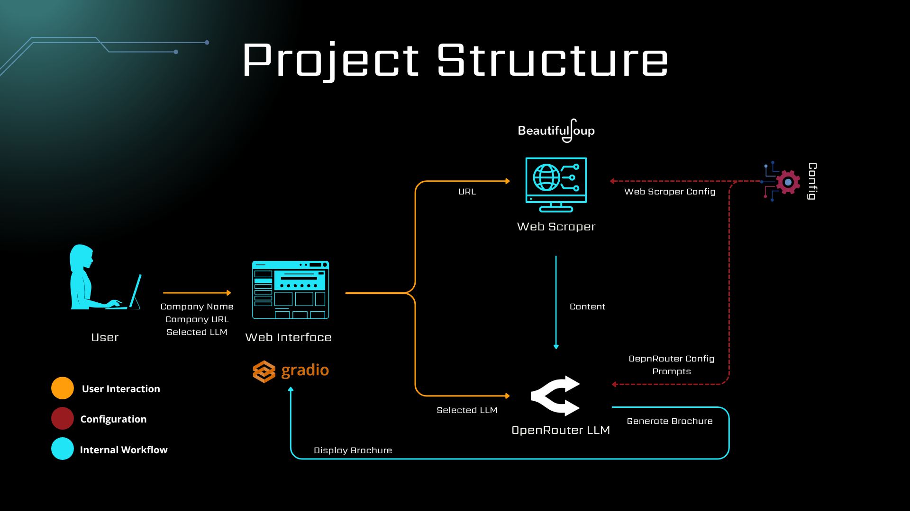

# Company Brochure Generator Using Gradio and Hugging Face Spaces

This tool is designed to generate a company brochure using **Large Language Models (LLMs)**. It uses **Gradio** fot the user interface and **Hugging Face Spaces** for deployment (Public link: https://huggingface.co/spaces/Moetez1998/genai-brochure-company). The tool supports a wide range of LLMs provided by **[OpenRouter](https://openrouter.ai/models)**.

As it can be seen in the demo, the user can provide the URL of the company and select the desired LLM from the dropdown menu. The relevant information are extracted from the website using **BeautifulSoup** and a brochure is generated based on the extracted data.

## Configuration

### Config file ([config.json](config/config.json))

| Parameter              | Description                                                                 |
|------------------------|-----------------------------------------------------------------------------|
| `web_scraper_config.timeout`             | Timeout for web scraping operations in seconds. Default is 10s                        |
| `open_router_config.base_url`             | OpenRouter API base URL                        |
| `open_router_config.max_tokens`             | Maximum number of tokens to generate in a single request. Default is 800 tokens                         |
| `open_router_config.temperature`             | Temperature for text generation sampling. Default is 0.1                        |
| `open_router_config.open_router_llms`             | Path to the OpenRouter supported LLMs                        |
| `prompts.system_prompt_file`             | Path to the system prompt file                        |
| `prompts.user_prompt_file`             | Path to the user prompt file                        |

### Supported LLMs list ([open_router_llms.json](config/open_router_llms.json))

This file defines the list of supported Large Language Models (LLMs) available through OpenRouter. Each entry includes the model's name (`model_name`) and its unique identifier (`model_id`), which is required by the OpenRouter API to specify exactly which model to use for text generation.\
The following table outlines some of the currently supported models:

| Model Name                          | Organization     | Parameters (B) | Description                                                                 |
|-------------------------------------|------------------|----------------|-----------------------------------------------------------------------------|
| **DeepHermes 3 – LLaMA 3 8B Preview** | Nous Research    | 8              | *Fast and lightweight* — Best for short content. Great performance for simple brochures. |
| **Mistral Small 3.1 – 24B**          | Mistral          | 24             | *Balanced* — Good speed + quality tradeoff. Ideal for most brochure use cases. |
| **Gemma 3 – 27B**                    | Google           | 27             | *Fluent and polished* — Produces well-structured, professional-sounding content. |
| **LLaMA 3.1 – 405B Instruct**        | Meta             | 405            | *High-capacity* — Best for long or dense pages. Slower, but handles complex info well. |

> 💡 Tips: If speed matters, start with **DeepHermes**. For large corporate sites or detailed brochures, try **LLaMA 405B**.
> If you don't find the model for your needs, add it in the [open_router_llms.json](config/open_router_llms.json) file or
 feel free to ask! I'm here to assist (moetez.lahdhiri@student-cs.fr).

### Prompt files
Feel free to adapt the system prompt file ([system_prompt.txt](config/system_prompt.txt)) for your specific needs. You can also use the user prompt file ([user_prompt.txt](config/user_prompt.txt)) to customize the content generation process. Make sure to keep `{company_name}` and `{content}` placeholders in the prompt.

## The Application

1. Loads OpenRouter API key from `.env` file.
2. Scrapes the webpage using [beautifulsoup](https://pypi.org/project/beautifulsoup4/) library.
3. Sends content to the selected LLM for brochure generation.
4. Displays the brochure in markdown format.

    

## Prototype Deployment on Hugging Face Spaces
You can easily deploy this prototype using [Hugging Face Spaces](https://huggingface.co/spaces), which provides free hosting for Gradio apps.

### 1. Get Your OpenRouter API Key  
Visit the [OpenRouter website](https://openrouter.ai/) to obtain your API Key.

- The **free plan** allows up to **100 requests per day**.  
- You can unlock **1,000 requests per day** by adding **10 credits** to your account.

> 💡 **Tip:** Use the *free-tier models* (i.e., model IDs ending with `:free`) to avoid consuming paid credits.

---

### 2. Set Up Your Hugging Face Space  
Go to [Hugging Face Spaces](https://huggingface.co/spaces) and click **"Create new Space"**.  
Configure it as follows:

- **SDK:** Select `Gradio` as the Space SDK  
- **Hardware:** The default **CPU Basic** instance (`2 vCPU`, `16 GB RAM`, `FREE`) is sufficient for this application

---

### 3. Configure Your Space  
To ensure the app works correctly, make sure to:

- ✅ Include a `requirements.txt` file to install necessary dependencies  
- 🔐 Add your OpenRouter API key in the **"Variables and secrets"** section of your Space settings  

    - Key: `OPENROUTER_API_KEY`  
    - Value: your personal API key from OpenRouter

## 💡 (BONUS) Other Brochure Generation Use Cases

This project is designed to be easily adaptable. Here are a few alternative use cases you can explore by tweaking the prompts or inputs:

- 🏫 **University Program Brochures**  
  Generate compelling overviews of academic programs from university web pages.

- 🏥 **Healthcare Services Brochures**  
  Summarize key services, values, and contact info from clinic or hospital websites.

- 🎓 **Bootcamps & Online Course Summaries**  
  Create engaging brochures for coding bootcamps, online platforms, or training centers.

- 🌍 **Non-Profit Organizations**  
  Generate donor-friendly content that summarizes a non-profit's mission and impact.

- 🎤 **Event or Conference Summaries**  
  Create brochures from event landing pages, outlining key speakers, agenda, and purpose.

> ✏️ To support other use cases, simply change the system and user prompts — the rest of the pipeline stays the same!
